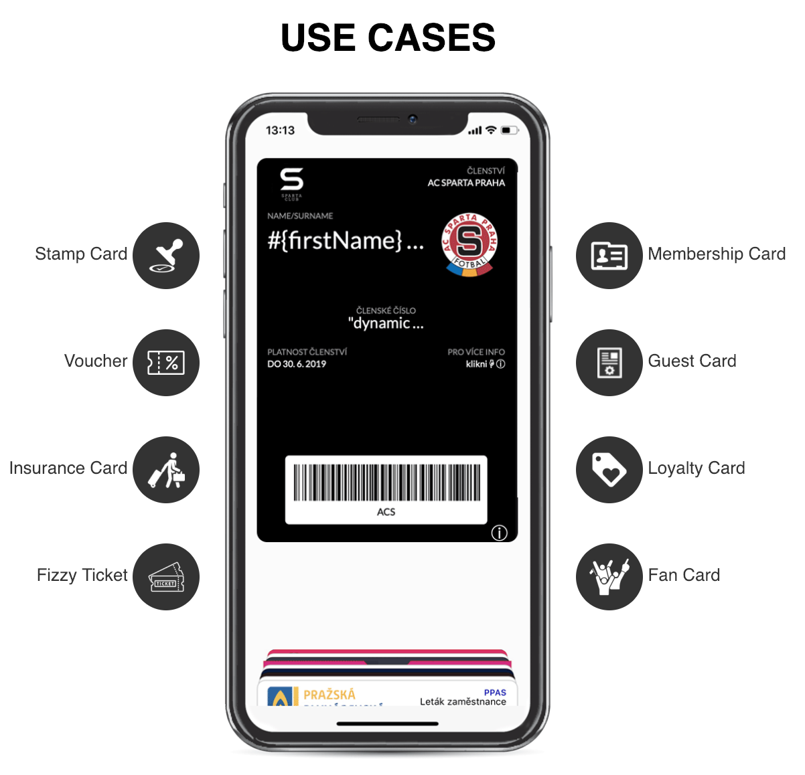

# Yourpass Javascript/Typescript client library

This JavaScript/Typescript Client Library helps to develop  client-application integration with Yourpass API. It offers simple, flexible and easy to use [Yourpass API](https://doc.yourpass.eu/).

### About Yourpass

[Yourpass](https://www.yourpass.eu/) is a platform and service for creating digital cards for mobile wallets in PKPASS and Google Pay formats.



If You do not know what is Yourpass please visit [Yourpass web site](https://www.yourpass.eu) for more information.

### Before you start

Before start you need to have Yourpass account. If you do not have Yourpass account go to [Yourpass Registration](https://https://login.yourpass.eu/?signup).

## Installation

```shell
npm install @yourpass/api-js-client --save
```

## Usage

This chapter describes basic usage of client. You can find more examples [here](/examples).

### Create OAuth2 client

First, you have to create client and authenticate using OAuth2.

For authentication You need:

* clientId: OAuth client id. You can get it on [Yourpass Console Profile Page](https://console.yourpass.eu/user/detail).
* clientSecret: OAuth client secret. You can get it on [Yourpass Console Profile Page](https://console.yourpass.eu/user/detail)
* username: Your Yourpass account username
* password: Your Yourpass account password

```javascript
import { Client, createOAuthFetch } from "@yourpass/api-js-client";

const productionUrlBase = "https://api.yourpass.eu";

const fetch = createOAuthFetch({
  clientId: "Your client ID",
  clientSecret: "Your client secret",
  username: "Your username",
  password: "Your password",
  url: productionUrlBase,
});

const client = new CoreClient({ fetch, urlBase: productionUrlBase });
```

### Pass listing

Use the following code to get list of digital passes:

```javascript
client.passList({ limit: 3 }).then((response) => {
  console.log(response);
});
```

### Pass create

Use the following code to create a new pass:

```javascript
conts pass = {
  templateId: "someTemplateId",
  dynamicData: {
    name: "Jan Novak",
    customerNr: 123456,
    loyaltyPoints: 0
  }
}

client.passCreate(pass).then((response) => {
  console.log(response);
});
```

### Pass update

Use the following code to update a pass:

```javascript
conts pass = {
  sid: "passId",
  templateId: "someTemplateId",
  dynamicData: {
    name: "Jan Novak",
    customerNr: 123456,
    loyaltyPoints: 10
  }
}

client.passUpdate(pass).then((response) => {
  console.log(response);
});
```

### Pass patch

Use the following code to patch the pass, eg. change pass template and update loyalty points:

```javascript
conts patch = {
  templateId: "someTemplateId2",
  dynamicData: {
    loyaltyPoints: 20
  }
}

client.passPatch(passId, patch).then((response) => {
  console.log(response);
});
```

## Documentation

See Yourpass Client [generated TypeDoc documentation](docs/).

For more information about API please visit [Yourpass API](https://doc.yourpass.eu/).

## Development

### Commands

- `npm run build` - compile typescript in to dist/ folder
- `npm run lint` - runs tslint check
- `npm run test` - runs all test
- `npm run test:unit` - runs unit tests
- `npm run test:integration` - runs integration test (see: [Itentegration test configuration](#itentegration-test-configuration))
- `npm run typedoc` - runs generate typedoc documentation
- `npm run prettier` - runs prettier to format code
- `npm publish --access public` - publish in npm registry

### Comfigure Test

Create .env file with your test account:

```
TEST_USERNAME=...
TEST_PASSWORD=...
TEST_CLIENT_ID=...
TEST_CLIENT_SECRET=...
TEST_API_URL=...
```

## Licence

Apache License 2.0
